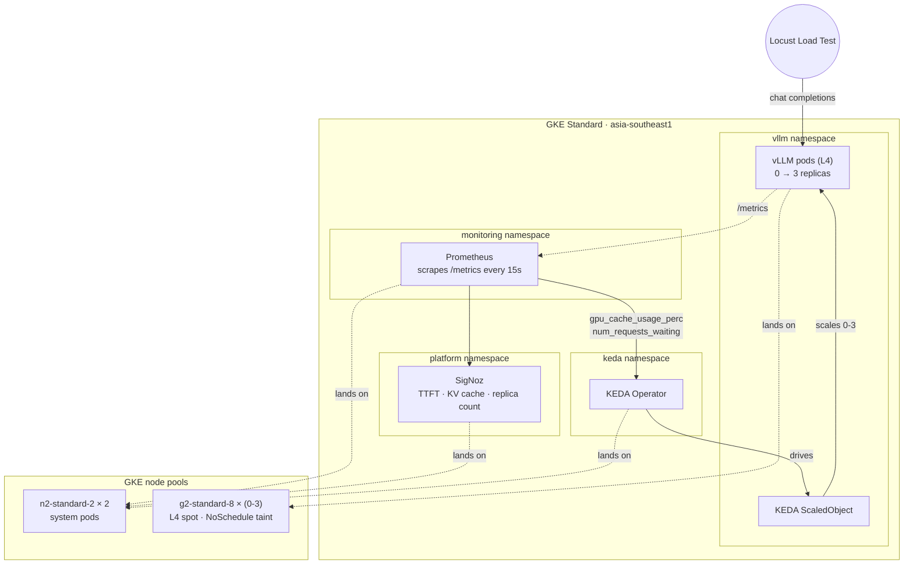
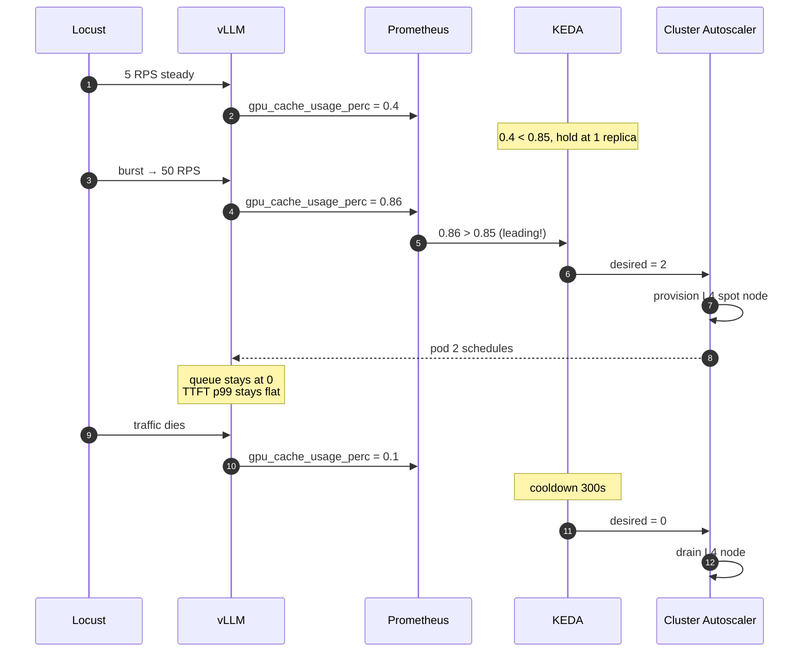

# GPU-Aware Autoscaler for LLM Inference on Kubernetes

A Kubernetes autoscaler that scales vLLM inference pods on **KV cache pressure** and **request queue depth** — not CPU. **Because CPU lies.**

**Spike traffic → cache fills → autoscaler reads it as a leading indicator → KEDA adds a replica → cluster autoscaler provisions an L4 → TTFT stays flat.**

---

### For non-technical readers

vLLM is a popular LLM-serving engine. When traffic spikes, a regular Kubernetes autoscaler doesn't notice — because the bottleneck on a GPU server isn't CPU, it's GPU memory. By the time CPU rises, your users are already waiting.

This project watches the right signal (GPU memory) and adds replicas *before* users feel pain.

### For technical readers

- KEDA watches `vllm:gpu_cache_usage_perc` (leading) and `vllm:num_requests_waiting` (lagging) from a Prometheus-scraped vLLM `/metrics` endpoint.
- Crossing 85% KV-cache usage triggers scale-up *before* the queue builds, giving the cluster autoscaler ~30s of headroom to provision an L4 spot node before users see TTFT spikes.
- Both triggers run via a single `ScaledObject`. KEDA takes the max of the desired replica counts.
- Deployment is GKE Standard + `g2-standard-8` spot pool, `NoSchedule`-tainted so only vLLM pods land on it. `minReplicaCount: 0` lets the pool drain to zero between bursts — hourly cost drops to ~$0.10 (control plane only).
- Helm-packaged for two shapes: `vind` (local CPU dev with `opt-125m`) and GKE GPU prod (`Qwen3-8B-Instruct AWQ-INT4` on L4).


## 📐 Architecture



### What's deployed

| # | Component | Where |
|---|---|---|
| 1 | vLLM serving pods | GKE GPU pool (L4 spot) |
| 2 | KEDA `ScaledObject` | `vllm` namespace |
| 3 | Prometheus + `ServiceMonitor` | `monitoring` namespace |
| 4 | SigNoz (traces + metrics) | `platform` namespace |

---

## 📊 What KEDA actually watches

Two triggers. KEDA evaluates each independently and scales to the max of the desired replica counts.



### Why `gpu_cache_usage_perc` is the leading indicator

When vLLM's PagedAttention cache fills past ~85%, it starts evicting blocks. Eviction breaks request affinity — partial generations re-prefill from scratch, which is expensive. TTFT spikes here, **before** the request queue builds.

Watching `num_requests_waiting` alone is too late: by the time the queue is non-zero, users are already feeling latency. Watching CPU is even later — vLLM rarely saturates CPU before GPU memory.

### Why KEDA, not HPA

HPA can't natively query custom Prometheus metrics. The workaround is `prometheus-adapter`, which exposes them as Kubernetes custom metrics — a fragile two-hop with its own controller and CRDs. KEDA is built for this exact case: declare a `ScaledObject` with a `prometheus` trigger, done. (KEDA generates an HPA under the hood, so this isn't a parallel autoscaler — it's the right primitive in front of the same machinery.)

---

## 🧪 The metrics that matter

| Metric | Type | Why |
|---|---|---|
| `vllm:gpu_cache_usage_perc` | **Leading** | Fills before the queue builds. Threshold: 0.85. |
| `vllm:num_requests_waiting` | **Lagging** | Queue depth = "we're already over capacity". Threshold: 5. |
| `vllm:e2e_request_latency_seconds` | User-facing | The thing we're protecting. Plotted as p50/p95/p99. |
| `vllm:tokens_per_second` | Throughput | Detects saturation when the queue is briefly empty but the GPU is full. |

CPU and memory are explicitly NOT used. There's a comment in `helm/vllm-server/values.yaml` next to the disabled HPA block explaining why.

---

## ⚡ Quick start

### Local dev (`vind`, no GPU required)

```bash
make cluster-up                      # spawn local vcluster
make install-keda
make install-prometheus
make install-vllm-cpu-dev            # opt-125m on CPU
make install-keda-scaler
make load-test                       # bursty Locust pattern
```

### GKE production

```bash
cd gcp/
cp terraform.tfvars.example terraform.tfvars   # then fill in your project ID
terraform apply

gcloud container clusters get-credentials autoscaler-gke \
  --region asia-southeast1 --project <your-project>

make install-keda install-prometheus install-signoz install-vllm install-keda-scaler
make metrics                         # verify scraping
make load-test                       # 5 min bursty traffic
```

---

## 🔁 Why Helm

Two deployment shapes today, three planned:

| Shape | Why it exists |
|---|---|
| `vind` local CPU dev | Fast iteration, no GPU spend |
| GKE GPU prod | The actual demo target |
| Future PD-disaggregated | Phase 4 — separate prefill / decode pools |

Three values files + one chart beats three duplicated copies of every manifest. Templating earns its keep here.

---

## ☁️ Infrastructure

| Component | What |
|---|---|
| GKE Standard | Required for per-pool GPU configuration; Autopilot abstracts it away |
| GPU node pool | `g2-standard-8` × (0-3), 1× L4 each, **Spot**, `nvidia.com/gpu=present:NoSchedule` taint |
| Default pool | `n2-standard-2` × 2, system pods + KEDA + Prometheus + SigNoz |
| Region | `asia-southeast1` (Singapore) — closest L4 capacity for South Asia |
| Workload Identity | Enabled |
| State | Terraform; `terraform.tfvars.example` is checked in, real `tfvars` is gitignored |

---

## 🛠️ Tools and why

| Tool | Why |
|---|---|
| **vLLM** | PagedAttention, OpenAI-compatible API, native Prometheus metrics. The 2026 reference engine. |
| **KEDA** | The only K8s autoscaler that natively takes Prometheus queries as scaling triggers. |
| **Prometheus + ServiceMonitor** | Standard. kube-prometheus-stack with the `release: prometheus` label selector. |
| **SigNoz** | OpenTelemetry-native single-platform observability. TTFT histograms, queue-depth timelines, replica count overlay. |
| **Locust** | Python-native bursty patterns; mixed prompt-length corpora are easy to express. |
| **Terraform** | Reproducible cluster, parameterized. AKS / EKS portable in principle. |
| **Helm** | Multiple deployment shapes share a chart cleanly. |
| **vind** | vCluster in Docker. Native LoadBalancer, pause / resume the laptop cluster between sessions. |

---

## 🗺️ Roadmap

- **PD-disaggregated serving** — separate prefill and decode pools, scale each on its own bottleneck. Mooncake / DistServe-style. The headline 2026 inference architecture.
- **Multi-LoRA serving** — one base model + N adapters, header-routed, per-tenant rate limits. Punica / S-LoRA kernels in vLLM.
- **EAGLE-3 speculative decoding** — measure 1.5-3× decode speedup with full latency + acceptance-rate eval.
- **Quantization comparison** — FP16 vs FP8 vs AWQ-INT4 on a 7B model: accuracy, throughput, TTFT, VRAM.
- **Token-level OTel tracing** — cost-per-1M-tokens dashboards, per-tenant TTFT P99 alerts.

### Current scope

A side project to learn the LLM-inference layer of MLOps end-to-end. Not a 5-nines production deployment.

- Single zone. A zone outage takes the demo down.
- L4 spot can be preempted mid-load-test (rare). Switch to on-demand for recorded demos.
- Synthetic Locust load. Real production traffic mixes much higher prompt-length variance.
- No PD-disaggregation, multi-LoRA, or spec decoding *yet* — those are Roadmap items, not omissions.
